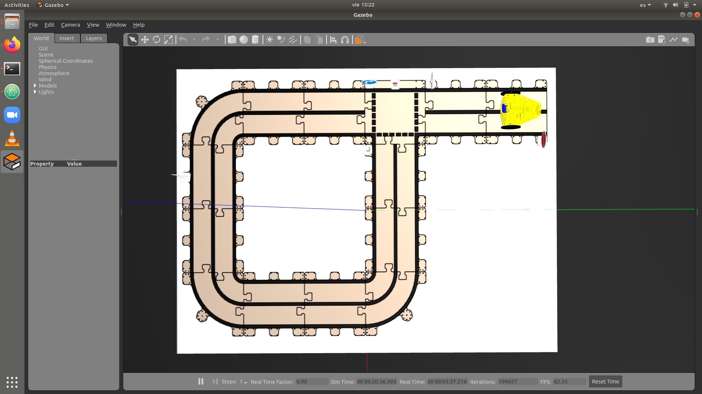
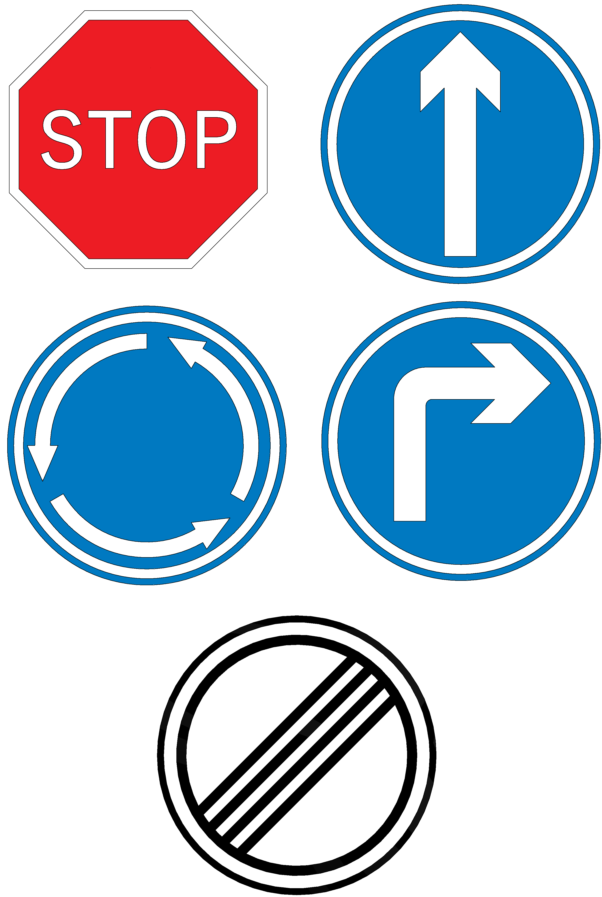

# Puzzlebot-Autonomo
Codigos que controlan de manera autonoma, el robot Puzzlebot de la comañia manchester Robotics en una pista determinada que se muestra a continuación.
- La pista que vamos a completar con este codigo es la siguiente:

No olvides calibrar las máscaras de filtradod e colores HSV, para poder detctar el semáforo a usar como las siguientes señales de trafico:

- Para poder iniciar ingresa los siguiente comandos al Puzzlebot por medio de ssh a la Jetson Nano que contiene:
```
rosrun (tu paquete de ROS) signal_detector.py
```
- Espera hasta que la terminal diga "Listo para clasificar"
- Despues inicial el seguidor de linea:
```
rosrun (tu paquete de ROS) seguir_sum_ver.py
```
- Inicia el detector de semáforos:
```
rosrun (tu paquete de ROS) traffic_detector.py
```
- Inicia el nodo de movimiento:
```
rosrun (tu paquete de ROS) seguidor_mov.py
```
- Cambia el nombre del modelo donde llamamos el modelo CNN en el signal_detector no lo olvides y si es necesario calibrar otra vez las máscaras de HSV hazlo.
